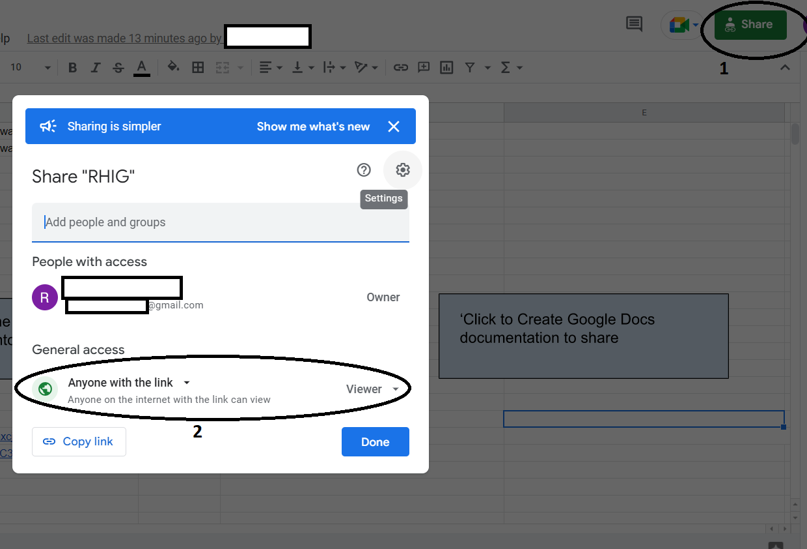

Create Web App and REST API

1) After opening the newly created Google Sheets file, click Share on the top right corner, and change <b>General Access</b> to "Anyone with the link"
  
2) Then click <b> Extensions, Apps Script </b>

3) Then, click <b>Deploy</b> on the upper right corner of the Apps Script window
4) Make sure you change "Execute as" to <b> Me </b>
5) Make sure you change "Who has access" to <b> Anyone </b>
6) Click <b>Deploy </b> on the bottom of this window.  Then select <b> New Deployment </b>

7) Copy the URL for the web app created

