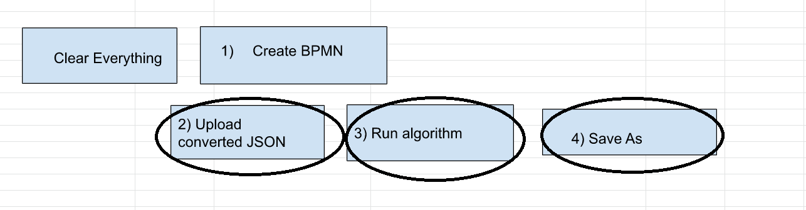

Upload JSON file and Run BPMN logic and create new Google Sheet

1) Click Upload converted JSON within the BPMN executable User Interface and choose the downloaded JSON file created in previous step

2) Run the logic within the BPMN diagram and you will see text data within google sheet that is part of the diagram

3)Click Save as to create a new Google Sheets specific to your BPMN process
4) Open the new sheet created 

<a href="createapp.md">Go to Next Step </a>
